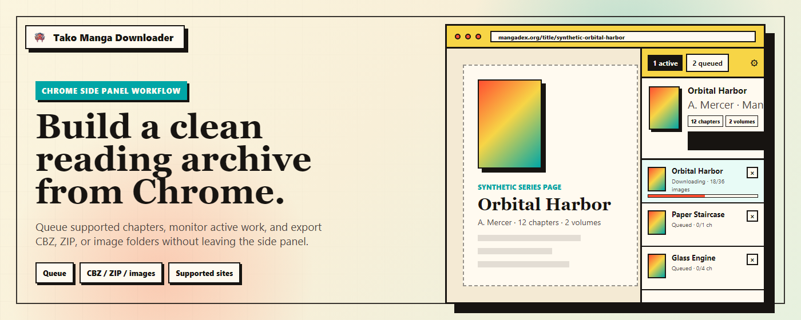

# Tako Manga Downloader

Tako is a Chrome extension that keeps chapter selection, queue management, and organized exports inside Chrome's Side Panel.

Instead of juggling extra tabs, repeated save dialogs, or brittle one-off scripts, you can review chapters, queue downloads, watch progress, and export cleaner offline-reading files from one workflow.

<p>
  <a href="https://chromewebstore.google.com/detail/tako-manga-downloader/hlodmckfkmbenkknmailfekehgajpmbb">
    
  </a>
</p>


## Why Tako

- **Stay in your reading flow**  
  The Side Panel keeps chapter selection and queue controls next to the page you are already on.
- **Use a real queue instead of one-off saves**  
  Active work, queued jobs, retries, and recent results stay together in one command center.
- **Export cleaner files**  
  Save as CBZ, ZIP, or image folders with path and filename templates that work better with reader apps and library tools.
- **Optimized site-support instead of generic scraping**  
  Integrations apply site-specific metadata, image handling, and queue behavior where the extension explicitly supports a site.
- **Tune everything from one settings page**  
  Global defaults and per-site overrides live in the options page instead of scattered browser prompts.

## Supported sites

| Site | Status |
|---|---|
| MangaDex | Supported |
| Pixiv Comic | Supported |
| Shonen Jump+ | Supported |
| Manhuagui | Supported |
| Comic Nettai | Supported |

## Rights and site access

Tako is intended for pages you can already access in your own browser session on supported sites.

- It is **not** a tool for bypassing paywalls, login restrictions, DRM, or copyright controls.
- It does **not** grant access rights you do not already have.

## Quick start

### Install from GitHub Releases

1. Open the repository **Releases** page and download the latest `tako-manga-downloader-vX.Y.Z-chrome.zip` asset.
2. Extract the zip to a folder on your machine.
3. Open `chrome://extensions`.
4. Enable **Developer mode**.
5. Choose **Load unpacked** and select the extracted extension folder.

Chrome will load Tako from that folder. You can pin it from the extensions menu if needed.

### Build locally and load in Chrome

```powershell
pnpm install
pnpm build
```

Then open `chrome://extensions`, enable **Developer mode**, choose **Load unpacked**, and select `.output\chrome-mv3`.

### Development

```powershell
pnpm dev
```

## Documentation

- `CONTRIBUTING.md` — general setup, workflow, code style, and PR expectations
- `docs/ARCHITECTURE.md` — core runtime, storage, messaging, and state flow
- `docs/CONTRIBUTING-SITE-INTEGRATION.md` — adding or maintaining supported-site integrations
- `docs/TEMPLATE-MACROS.md` — filename and path-template macro reference

## Privacy

Tako stores settings, queue state, and history locally in the browser so the extension can function. Network requests are made directly to supported sites and related infrastructure needed for the user's requested workflow; the extension does not run a developer analytics backend for browsing history or downloaded chapter contents.

See [`PRIVACY.md`](PRIVACY.md) for the current privacy policy text.

## Contributing

We welcome contributions from the community. Please read the [`contributing guidelines`](CONTRIBUTING.md) before submitting a pull request.
