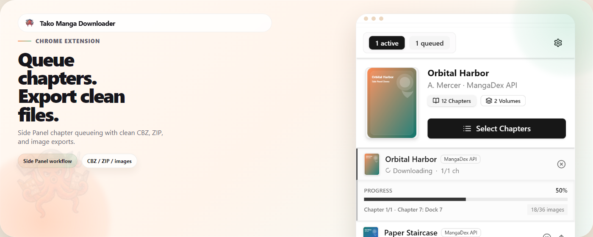
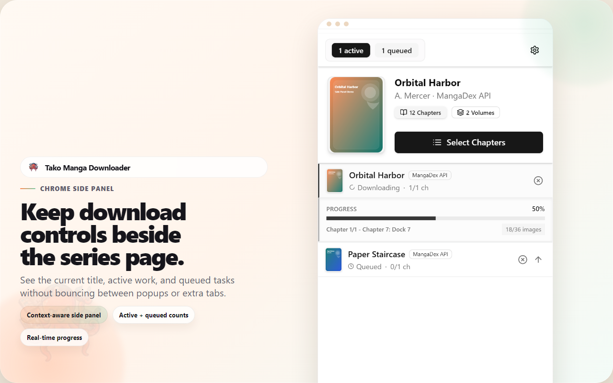
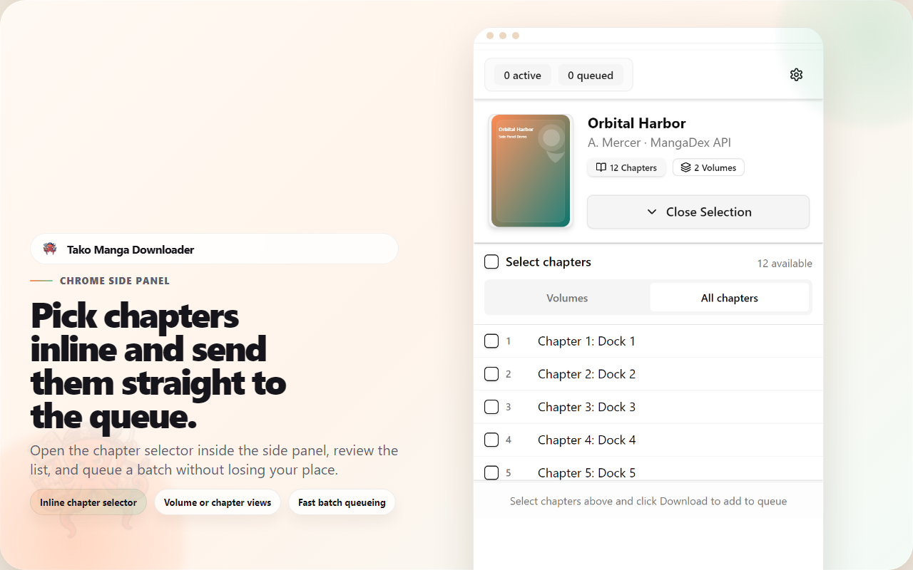
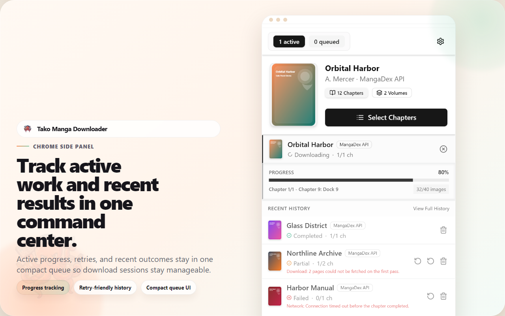
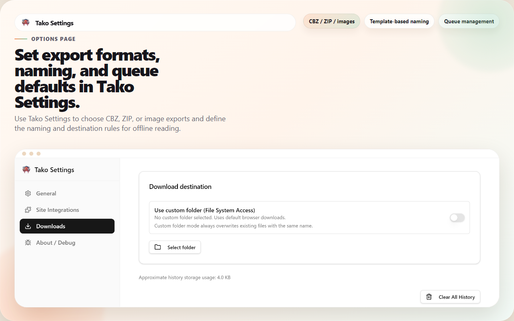
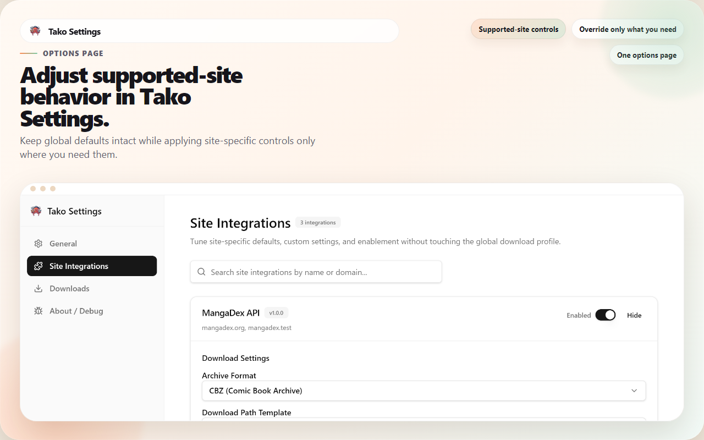

# Tako Manga Downloader



Tako is a Chrome extension that keeps chapter selection, queue management, and organized exports inside Chrome's Side Panel.

Instead of juggling extra tabs, repeated save dialogs, or brittle one-off scripts, you can review supported chapters, queue work, watch progress, and export cleaner offline-reading files from one workflow.

## Why Tako

- **Stay in the current reading flow**  
  The side panel keeps chapter selection and queue controls next to the page you are already using.
- **Use a real queue instead of one-off saves**  
  Active work, queued jobs, retries, and recent results stay together in one command center.
- **Export cleaner files**  
  Save as CBZ, ZIP, or image folders with path and filename templates that work better with reader apps and library tools.
- **Rely on supported-site logic instead of generic scraping**  
  Integrations can apply site-specific metadata, image handling, and queue behavior where the extension explicitly supports a site.
- **Tune everything from one settings page**  
  Global defaults and per-site overrides live in the options page instead of scattered browser prompts.

## Supported sites

| Site | Status | What Tako supports |
|---|---|---|
| MangaDex | Supported | Rich series metadata, chapter discovery, language-aware flows, and image quality preferences. |
| Pixiv Comic | Supported | Reader-page downloads with site-specific handling for protected image flows and metadata. |
| Shonen Jump+ | Supported | Episode downloads with cleaner defaults for offline reading and organized exports. |

## Rights and site access

Tako is intended for pages the user can already access in their own browser session on supported sites.

- It is **not** positioned as a tool for bypassing paywalls, login restrictions, DRM, or copyright controls.
- It does **not** grant access rights the user does not already have.
- Store assets and README screenshots in this repository use **synthetic data** rather than third-party manga artwork.

## Screenshots

### Side Panel overview



### Inline chapter selection



### Queue and recent history



### Download settings



### Site integrations




## Privacy

Tako stores settings, queue state, and history locally in the browser so the extension can function. Network requests are made directly to supported sites and related infrastructure needed for the user's requested workflow; the extension does not run a developer analytics backend for browsing history or downloaded chapter contents.

See [`PRIVACY.md`](PRIVACY.md) for the current privacy policy text.

## Quick start

### Install from GitHub Releases

1. Open the repository's **Releases** page and download the latest `tako-manga-downloader-vX.Y.Z-chrome.zip` asset.
2. Extract the zip to a folder on your machine.
3. Open `chrome://extensions`.
4. Enable **Developer mode**.
5. Choose **Load unpacked** and select the extracted extension folder.

Chrome will load Tako from that folder, and you can pin it from the extensions menu if needed.

### Build locally and load in Chrome

```powershell
pnpm install
pnpm build
```

Then open `chrome://extensions`, enable **Developer mode**, choose **Load unpacked**, and select `.output\chrome-mv3`.

### Development

```powershell
pnpm dev
```

### Validation

```powershell
pnpm lint
pnpm type-check
pnpm test:unit
pnpm test:integration
pnpm test:e2e
```

## Documentation

Start with the guide that matches the area you are changing:

- `docs/ARCHITECTURE.md` — core runtime, UI, storage, and state flow
- `docs/CONTRIBUTING-SITE-INTEGRATION.md` — adding or maintaining supported-site integrations
- `docs/MESSAGING.md` — runtime message reference and sender rules
- `docs/TEMPLATE-MACROS.md` — filename and path-template macro reference

## Contributing

Follow the existing code style and test patterns in the area you are changing. If behavior, contributor workflow, or submission assets change, update the relevant docs in the same pull request.
