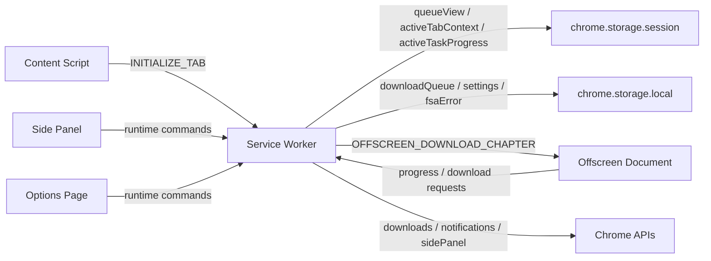

# Tako Architecture Guide

This is the main contributor guide for Tako's core extension architecture.

If you are changing queue behavior, background state, side panel UX, options flows, storage, or test infrastructure, start here.

## System overview

Tako is a Chrome Manifest V3 extension built around a service-worker-first architecture.

The background service worker is the only place that owns queue mutations and durable runtime orchestration. The side panel and options page are reactive clients. Heavy chapter work moves into a single offscreen document. Content scripts stay focused on supported-page detection and extraction.



## Runtime surfaces

| Surface | Main location | What it owns | What it must not own |
|---|---|---|---|
| Background service worker | `entrypoints/background/` | Queue lifecycle, startup, storage projection, sender resolution, offscreen lifecycle, notifications | DOM-heavy work, long-lived in-memory truth |
| Content script | `entrypoints/content/` | Supported-page detection, chapter extraction, page-scoped metadata, page-originated preference bridges when required | Global queue state, privileged Chrome download work |
| Offscreen document | `entrypoints/offscreen/` | Image resolution, downloads, archive creation, descrambling, ComicInfo assembly, browser-download handoff | Direct storage access, global queue mutation |
| Side panel | `entrypoints/sidepanel/` | Command center UI, chapter selection state, active-task and history display, user-triggered commands | Direct queue mutation in storage |
| Options page | `entrypoints/options/` | Settings editor, full history UI, maintenance flows, FSA folder coordination | Direct queue mutation in storage |

## Core architectural rules

- **The service worker is the mutation authority**
  Queue and settings changes flow through the background runtime, not direct UI storage writes.

- **Listeners register synchronously**
  MV3 can drop wake-up events when listener registration waits on async startup work.

- **Session storage powers reactive UI**
  The side panel and options page subscribe to projected state instead of waiting for ad hoc push messages.

- **Offscreen handles heavy work**
  Archive creation, image transforms, and similar work belong in the offscreen document, not the service worker.

- **Site integrations stay integration-agnostic at the contract boundary**
  Shared message types stay generic. Integration-specific runtime data travels through `integrationContext`.

## Storage model

### Durable storage

`chrome.storage.local` keeps state that must survive worker restarts and browser restarts.

| Key | Purpose |
|---|---|
| `downloadQueue` | Durable task history and queue state |
| `settings:global` | Canonical persisted settings |
| `fsaError` | Persistent File System Access fallback state |

### Reactive session projections

`chrome.storage.session` keeps state that the UI should react to quickly without rewriting the durable queue on every small update.

| Key | Purpose |
|---|---|
| `queueView` | Side-panel-friendly queue summary list |
| `activeTabContext` | Current tracked tab's supported-page context |
| `activeTaskProgress` | Lightweight progress state for the currently running task |
| `lastOffscreenActivity` | Liveness timestamp for offscreen recovery |
| `pendingDownloads` | Browser-download tracking for blob cleanup and idle teardown |
| `initFailed` | Fatal startup failure flag |
| `error` | Startup failure message companion |

### IndexedDB

Tako stores the selected File System Access directory handle in IndexedDB because directory handles cannot live in `chrome.storage`.

## Queue model

The queue uses six task statuses:

- `queued`
- `downloading`
- `completed`
- `partial_success`
- `failed`
- `canceled`

Display order is:

1. Active task
2. Queued tasks in FIFO order
3. Terminal tasks with newest completions first

Important invariants:

- Only one task is active at a time.
- Retry and restart actions create new tasks instead of mutating history into place.
- The side panel shows only a short history slice; the options page reads the full durable history.

## Messaging model

Tako uses two communication patterns.

### Direct runtime messages

Use runtime messages for commands and worker-to-offscreen coordination.

Examples:

- `START_DOWNLOAD`
- `OPEN_OPTIONS`
- `CLEAR_ALL_HISTORY`
- `OFFSCREEN_DOWNLOAD_CHAPTER`
- `OFFSCREEN_DOWNLOAD_PROGRESS`
- `OFFSCREEN_DOWNLOAD_API_REQUEST`
- `STATE_ACTION`

### Storage-driven UI updates

Use `chrome.storage.onChanged` for passive UI reactivity.

The side panel and options page should usually read:

- `queueView`
- `activeTabContext`
- `activeTaskProgress`
- `initFailed`
- `error`

## Sender context rules

Chrome sender context is easy to get wrong in extension code.

- **Content scripts** get `sender.tab`.
- **Extension pages** such as the side panel and options page do not get `sender.tab`.
- **Offscreen documents** do not get `sender.tab`.

If a handler needs a tab ID and it can be called by an extension page, accept a payload fallback such as `sourceTabId` and resolve it with `entrypoints/background/sender-resolution.ts`.

## Main code map

### Entrypoints

| Path | Purpose |
|---|---|
| `entrypoints/background/` | Background runtime, startup barrier, queue orchestration, sender resolution, notifications, tab cache, projections |
| `entrypoints/content/` | Supported-page bootstrap and extraction plumbing |
| `entrypoints/offscreen/` | Download pipeline, archive creation, image processing, runtime bridge |
| `entrypoints/sidepanel/` | Command center UI, hooks, local chapter-selection state |
| `entrypoints/options/` | Settings UI, history UI, FSA management, tab routing |

### Shared source

| Path | Purpose |
|---|---|
| `src/runtime/` | Cross-context runtime helpers, schemas, registries, projections, storage keys |
| `src/shared/` | Pure utilities such as template resolution, filename sanitization, ComicInfo helpers, HTML decoding |
| `src/storage/` | Persistence helpers and services |
| `src/site-integrations/` | Supported-site manifest, registry helpers, runtime implementations |
| `src/types/` | Message, state, settings, and integration contracts |
| `src/ui/shared/` | Shared UI hooks and components used by multiple extension pages |

### Test layout

| Path | Purpose |
|---|---|
| `tests/unit/` | Pure logic, message, state, and component contracts |
| `tests/e2e/` | Deterministic extension behavior with mocked routes |
| `tests/live/` | Real-site validation against supported integrations |

## Where to work for common changes

- **Queue behavior**
  Start in `entrypoints/background/download-queue*.ts`, `entrypoints/background/task-lifecycle.ts`, and `entrypoints/background/projection.ts`.

- **Side panel UX**
  Start in `entrypoints/sidepanel/components/`, `entrypoints/sidepanel/hooks/`, and `entrypoints/sidepanel/SidePanelApp.tsx`.

- **Options page flows**
  Start in `entrypoints/options/tabs/`, `entrypoints/options/components/`, and `entrypoints/options/hooks/`.

- **Download pipeline or archive behavior**
  Start in `entrypoints/offscreen/main.ts`, `entrypoints/offscreen/archive-creator.ts`, `entrypoints/offscreen/image-processor.ts`, and `entrypoints/background/destination.ts`.

- **Storage or settings behavior**
  Start in `src/storage/`, `src/runtime/storage-keys.ts`, and the relevant background action handlers.

- **Site detection or supported-site extraction**
  Start in `src/site-integrations/`, `entrypoints/content/`, and `src/runtime/site-integration-initialization.ts`.

## Current integration profile

| Integration | Strengths |
|---|---|
| `mangadex` | Rich metadata, language and image-quality controls, preference bridge support |
| `pixiv-comic` | Auth-aware requests, protected-viewer support, image reconstruction |
| `shonenjumpplus` | Official episode-page support, image reconstruction, manga-oriented metadata defaults |

## Validation commands

```powershell
pnpm build
pnpm lint
pnpm type-check
pnpm test:unit
pnpm test:integration
pnpm test:e2e
pnpm test:live:ci
```

Use the targeted command first when you are iterating on one area, then run the broader suite before finishing.

## References

- [WXT guide](https://wxt.dev/guide)
- [WXT extension API limitations](https://wxt.dev/guide/essentials/extension-apis)
- [Chrome MV3 service worker lifecycle](https://developer.chrome.com/docs/extensions/develop/concepts/service-workers/lifecycle)
- [Chrome Side Panel API](https://developer.chrome.com/docs/extensions/reference/api/sidePanel)
- [Chrome Runtime Messaging](https://developer.chrome.com/docs/extensions/reference/api/runtime#method-sendMessage)
- [Chrome Storage API](https://developer.chrome.com/docs/extensions/reference/api/storage)
- [Chrome Offscreen API](https://developer.chrome.com/docs/extensions/reference/api/offscreen)
- [React `useSyncExternalStore`](https://react.dev/reference/react/useSyncExternalStore)
