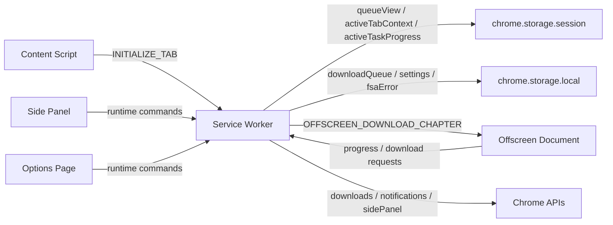
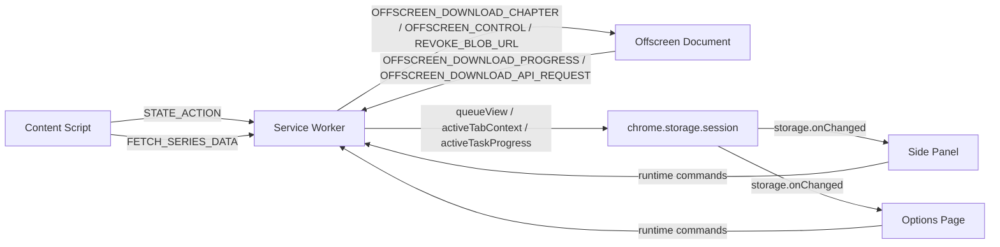

# Tako Architecture Guide

This is the main contributor guide for Tako's core extension architecture.

If you are changing queue behavior, background state, side panel UX, options flows, storage, or test infrastructure, start here.

## System overview

Tako is a Chrome Manifest V3 extension built around a service-worker-first architecture.

The service worker owns all queue mutations and durable runtime orchestration. The Side Panel and options page are reactive clients. Heavy chapter work moves into a single offscreen document. Content scripts stay focused on supported-page detection and extraction.



## Runtime surfaces

| Surface | Main location | What it owns | What it must not own |
|---|---|---|---|
| Background service worker | `entrypoints/background/` | Queue lifecycle, startup, storage projection, sender resolution, offscreen lifecycle, notifications | DOM-heavy work, long-lived in-memory truth |
| Content script | `entrypoints/content/` | Supported-page detection, chapter extraction, page-scoped metadata, preference bridges | Global queue state, privileged Chrome download work |
| Offscreen document | `entrypoints/offscreen/` | Image resolution, downloads, archive creation, descrambling, DOM/web-API-assisted processing, ComicInfo assembly, browser-download handoff | Direct storage access, global queue mutation, live page DOM access |
| Side Panel | `entrypoints/sidepanel/` | Command center UI, chapter selection state, active-task and history display, user-triggered commands | Direct queue mutation in storage |
| Options page | `entrypoints/options/` | Settings editor, full history UI, maintenance flows, FSA folder coordination | Direct queue mutation in storage |

## Core architectural rules

- **The service worker is the mutation authority.**  
  Queue and settings changes flow through the background runtime, not direct UI storage writes.

- **Listeners register synchronously.**  
  MV3 can drop wake-up events when listener registration waits on async startup work.

- **Session storage powers reactive UI.**  
  The Side Panel and options page subscribe to projected state instead of waiting for ad hoc push messages.

- **Offscreen handles heavy document work.**  
  Archive creation, image transforms, DOMParser/iframe-based scraping, and similar web-API work belong in the offscreen document, not the service worker. Offscreen documents have DOM access but only the `chrome.runtime` extension API, so storage and privileged Chrome API calls still route through the service worker.

- **Site integration runtimes are context-scoped.**  
  The manifest is metadata-only. Runtimes are statically imported through generated registries under `src/runtime/generated/`. Content scripts load only `content-runtime.ts`, the service worker loads only `background-runtime.ts`, and offscreen loads only `offscreen-runtime.ts`. Because MV3 service workers do not support dynamic `import()`, a content script that needs API-backed series data sends `FETCH_SERIES_DATA` to the service worker instead of importing background or offscreen modules directly. The registry generator, ESLint rules, and `tests/unit/site-integration-context-boundaries.spec.ts` enforce these boundaries.

- **Site integrations stay integration-agnostic at the contract boundary.**  
  Shared message types stay generic. Integration-specific runtime data travels through `integrationContext`.

- **Volume grouping is explicit.**  
  Integrations that know the source site's chapter categories should provide `MangaPageState.volumes[]` and set `Chapter.volumeId` to those opaque IDs. `Volume.title` / `label` and `Chapter.volumeLabel` preserve the site-visible label; `volumeNumber` is numeric metadata for fallback ordering, not identity.

## Storage model

### Durable storage

`chrome.storage.local` keeps state that must survive worker restarts and browser restarts.

| Key | Purpose |
|---|---|
| `downloadQueue` | Durable task history and queue state |
| `settings:global` | Canonical persisted settings |
| `fsaError` | Persistent File System Access fallback state |
| `siteOverrides` | Per-site output format, path template, rate-limit, and retry overrides |
| `siteIntegrationSettings` | Manifest-defined custom settings values by integration |
| `siteIntegrationEnablement` | User-facing integration enablement overrides |
| `downloadedChapters` | Canonical chapter-level download history |
| `seriesDownloadHistory` | Series-grouped download history |

### Reactive session projections

`chrome.storage.session` keeps state that the UI should react to quickly without rewriting the durable queue on every small update.

| Key | Purpose |
|---|---|
| `globalState` | Service-worker-owned runtime state, including the queue and settings snapshot |
| `tab_<tabId>` | Per-tab supported-page state for detected series and chapters |
| `queueView` | Side-panel-friendly queue summary list |
| `activeTabContext` | Current tracked tab's supported-page context |
| `activeTaskProgress` | Lightweight progress state for the currently running task |
| `lastOffscreenActivity` | Liveness timestamp for offscreen recovery |
| `pendingDownloads` | Browser-download tracking for blob cleanup and idle teardown |
| `initFailed` | Fatal startup failure flag |
| `error` | Startup failure message companion |

### IndexedDB

Tako stores the selected File System Access directory handle in IndexedDB because directory handles cannot live in `chrome.storage`.

## Queue model

The queue uses six task statuses:

- `queued`
- `downloading`
- `completed`
- `partial_success`
- `failed`
- `canceled`

Display order is:

1. Active task
2. Queued tasks in FIFO order
3. Terminal tasks with newest completions first

Important invariants:

- Only one task is active at a time.
- Retry and restart actions create new tasks instead of mutating history into place.
- The Side Panel shows only a short history slice; the options page reads the full durable history.

## Messaging model

Tako uses two channels:

- **Runtime messages** for commands, queue mutations, and worker-to-offscreen coordination.
- **`chrome.storage.onChanged`** for passive UI reactivity in the Side Panel and options page.



### Background routing boundaries

| Routed to offscreen | Purpose |
|---|---|
| `OFFSCREEN_STATUS` | Query offscreen liveness |
| `OFFSCREEN_CONTROL` | Task cancellation |
| `REVOKE_BLOB_URL` | Blob cleanup after download handoff |
| `OFFSCREEN_DOWNLOAD_CHAPTER` | Dispatch one chapter for download |

| Handled by background | Purpose |
|---|---|
| `GET_TAB_ID` | Resolve sender tab ID |
| `STATE_ACTION` | Service-worker state mutations |
| `FETCH_SERIES_DATA` | Request API-backed series metadata and chapter list |
| `OFFSCREEN_DOWNLOAD_API_REQUEST` | Proxy `chrome.downloads.download()` from offscreen |
| `OFFSCREEN_DOWNLOAD_PROGRESS` | Receive progress from offscreen |
| `START_DOWNLOAD` / `RETRY_FAILED_CHAPTERS` / `RESTART_TASK` / `MOVE_TASK_TO_TOP` / `CLEAR_ALL_HISTORY` | Queue and task actions |

### `FETCH_SERIES_DATA` contract

Content scripts request API-backed series data from the service worker without importing background runtime modules into the content bundle.

Payload: `siteIntegrationId`, `seriesId`, optional `language`.

Response (`success: true`): optional `seriesMetadata`, optional `chapterList`, optional `metadataError` / `chapterListError` when one fetch fails but the other succeeds. Missing fields mean "not supplied by this integration," not a transport failure. A transport failure returns `success: false` with `error`.

### `START_DOWNLOAD` payload highlights

Carries `sourceTabId`, `siteIntegrationId`, `mangaId`, `seriesTitle`, chapter labels, `volumeId`, numeric metadata, and optional series snapshot metadata.

`volumeId`, `volumeLabel`, and `volumeNumber` are intentionally separate:

- `volumeId` is the opaque grouping key from `MangaPageState.volumes[].id`. Not displayed, not parsed as a number.
- `volumeLabel` preserves the site's visible group/category label.
- `volumeNumber` is parsed numeric metadata when the integration can derive it.

### Offscreen contracts

**Service worker → offscreen**

- `OFFSCREEN_DOWNLOAD_CHAPTER` sends book metadata, chapter metadata, `settingsSnapshot`, `saveMode`, and optional `integrationContext`. The offscreen document resolves the matching `offscreen-runtime.ts` and runs its chapter/image hooks.
- `OFFSCREEN_CONTROL` is used for task cancellation.
- `REVOKE_BLOB_URL` tells offscreen code to revoke a blob URL after download handoff completes or fails.

**Offscreen → service worker**

- `OFFSCREEN_DOWNLOAD_PROGRESS` carries task status, error classification, image counters, and FSA fallback flags.
- `OFFSCREEN_DOWNLOAD_API_REQUEST` requests a `chrome.downloads.download()` call from the service worker. The success payload uses `id` for the Chrome download ID.

### Storage-driven UI updates

The Side Panel and options page react to projected state instead of relying on unsolicited UI events.

Reactive keys:

- `queueView`
- `activeTabContext`
- `activeTaskProgress`
- `initFailed`
- `error`

### Async handler contract

Chrome MV3 async message handlers must return `true` from the listener and resolve through `sendResponse(...)`.

In this codebase:

- The background runtime wraps async routing in `entrypoints/background/background-runtime-listeners.ts`.
- The offscreen runtime wraps async routing in `entrypoints/offscreen/runtime-bridge.ts`.

All error paths must resolve `{ success: false, error }` rather than leaving callers hanging.

## Sender context rules

Some handlers depend on sender context, and extension pages do not receive `sender.tab`.

| Message | Typical senders | Resolution rule |
|---|---|---|
| `GET_TAB_ID` | Content script | Requires `sender.tab.id` |
| `START_DOWNLOAD` | Side Panel, content script | Use `sender.tab.id` when present; otherwise fall back to `payload.sourceTabId` |
| `CLEAR_ALL_HISTORY` | Options page | Validate sender URL belongs to the options page |
| Tab-scoped `STATE_ACTION` | Content script, extension pages | Prefer `message.tabId`, then `sender.tab.id` |

See `entrypoints/background/sender-resolution.ts` for the implementation.

## Main code map

### Entrypoints

| Path | Purpose |
|---|---|
| `entrypoints/background/` | Background runtime, startup barrier, queue orchestration, sender resolution, notifications, tab cache, projections |
| `entrypoints/content/` | Supported-page bootstrap and extraction plumbing |
| `entrypoints/offscreen/` | Download pipeline, archive creation, image processing, runtime bridge |
| `entrypoints/sidepanel/` | Command center UI, hooks, local chapter-selection state |
| `entrypoints/options/` | Settings UI, history UI, FSA management, tab routing |

### Shared source

| Path | Purpose |
|---|---|
| `src/runtime/` | Cross-context runtime helpers, schemas, registries, projections, storage keys |
| `src/shared/` | Pure utilities such as template resolution, filename sanitization, ComicInfo helpers, HTML decoding |
| `src/storage/` | Persistence helpers and services |
| `src/site-integrations/` | Supported-site manifest, registry helpers, runtime implementations |
| `src/types/` | Message, state, settings, and integration contracts |
| `src/ui/shared/` | Shared UI hooks and components used by multiple extension pages |

### Test layout

| Path | Purpose |
|---|---|
| `tests/unit/` | Pure logic, message, state, and component contracts |
| `tests/e2e/` | Deterministic extension behavior with mocked routes |
| `tests/live/` | Real-site validation against supported integrations |

## Where to work for common changes

- **Queue behavior**
  Start in `entrypoints/background/download-queue*.ts`, `entrypoints/background/task-lifecycle.ts`, and `entrypoints/background/projection.ts`.

- **Side panel UX**
  Start in `entrypoints/sidepanel/components/`, `entrypoints/sidepanel/hooks/`, and `entrypoints/sidepanel/SidePanelApp.tsx`.

- **Options page flows**
  Start in `entrypoints/options/tabs/`, `entrypoints/options/components/`, and `entrypoints/options/hooks/`.

- **Download pipeline or archive behavior**
  Start in `entrypoints/offscreen/main.ts`, `entrypoints/offscreen/chapter-processing.ts`, `entrypoints/offscreen/chapter-image-downloads.ts`, `entrypoints/offscreen/zip.worker.ts`, `entrypoints/offscreen/image-processor.ts`, and `entrypoints/background/destination.ts`.

- **Storage or settings behavior**
  Start in `src/storage/`, `src/runtime/storage-keys.ts`, and the relevant background action handlers.

- **Site detection or supported-site extraction**
  Start in `src/site-integrations/`, `entrypoints/content/`, `src/runtime/site-integration-initialization.ts`, and the generated static site-integration context registries.

## Current integration profile

| Integration | Strengths |
|---|---|
| `mangadex` | Rich metadata, language and image-quality controls, preference bridge support |
| `pixiv-comic` | Auth-aware requests, protected-viewer support, image reconstruction |
| `shonenjumpplus` | Official episode-page support, image reconstruction, manga-oriented metadata defaults |
| `manhuagui` | Series-page extraction, adult-gated chapter-list handling, reader-config image URL resolution, Manhuagui referrer/cookie handling |
| `comicnettai` | PUBLUS viewer support, tile-based image reconstruction, DOM-backed series and chapter extraction |

## Validation commands

```powershell
pnpm build
pnpm lint
pnpm type-check
pnpm test:unit
pnpm test:integration
pnpm test:e2e
pnpm test:live:ci
```

Use the targeted command first when iterating on one area, then run the broader suite before finishing.

## References

- [WXT guide](https://wxt.dev/guide)
- [WXT extension API limitations](https://wxt.dev/guide/essentials/extension-apis)
- [Chrome MV3 service worker lifecycle](https://developer.chrome.com/docs/extensions/develop/concepts/service-workers/lifecycle)
- [Chrome Side Panel API](https://developer.chrome.com/docs/extensions/reference/api/sidePanel)
- [Chrome Runtime Messaging](https://developer.chrome.com/docs/extensions/reference/api/runtime#method-sendMessage)
- [Chrome Storage API](https://developer.chrome.com/docs/extensions/reference/api/storage)
- [Chrome Offscreen API](https://developer.chrome.com/docs/extensions/reference/api/offscreen)
- [React `useSyncExternalStore`](https://react.dev/reference/react/useSyncExternalStore)
