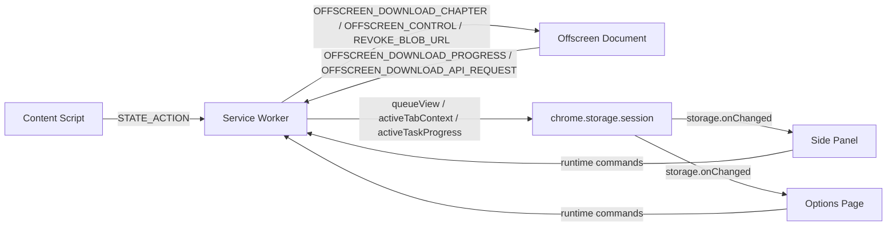

# Tako Messaging Reference

This document is the focused reference for the extension's runtime messaging surface.

## Authoritative source files

- `src/types/extension-messages.ts`
- `src/types/runtime-command-messages.ts`
- `src/types/offscreen-messages.ts`
- `src/types/state-action-message.ts`
- `src/runtime/message-schemas.ts`
- `entrypoints/background/background-message-router.ts`
- `entrypoints/background/sender-resolution.ts`
- `entrypoints/offscreen/runtime-bridge.ts`

## Communication model

Tako uses two channels:

- **Runtime messages** for commands, queue mutations, and worker-to-offscreen coordination
- **`chrome.storage.onChanged`** for passive UI updates in the side panel and options page

## Extension message families

`ExtensionMessage` currently includes:

- `GET_TAB_ID`
- `GET_SETTINGS`
- `SYNC_SETTINGS_TO_STATE`
- `ACKNOWLEDGE_ERROR`
- `OFFSCREEN_STATUS`
- `OFFSCREEN_CONTROL`
- `OFFSCREEN_DOWNLOAD_CHAPTER`
- `OFFSCREEN_DOWNLOAD_PROGRESS`
- `OFFSCREEN_DOWNLOAD_API_REQUEST`
- `REVOKE_BLOB_URL`
- `RETRY_FAILED_CHAPTERS`
- `RESTART_TASK`
- `MOVE_TASK_TO_TOP`
- `CLEAR_ALL_HISTORY`
- `OPEN_OPTIONS`
- `START_DOWNLOAD`
- `STATE_ACTION`

All async handlers should resolve with a structured success or error payload.

## Background routing boundaries

### Routed to the offscreen document

- `OFFSCREEN_STATUS`
- `OFFSCREEN_CONTROL`
- `REVOKE_BLOB_URL`
- `OFFSCREEN_DOWNLOAD_CHAPTER`

### Handled directly by the background runtime

- `GET_TAB_ID`
- `STATE_ACTION`
- `ACKNOWLEDGE_ERROR`
- `GET_SETTINGS`
- `SYNC_SETTINGS_TO_STATE`
- `OFFSCREEN_DOWNLOAD_API_REQUEST`
- `RETRY_FAILED_CHAPTERS`
- `RESTART_TASK`
- `MOVE_TASK_TO_TOP`
- `CLEAR_ALL_HISTORY`
- `OPEN_OPTIONS`
- `START_DOWNLOAD`
- `OFFSCREEN_DOWNLOAD_PROGRESS`

## State actions

`STATE_ACTION` is the generic envelope for service-worker-owned state mutations.

The current actions are:

- `INITIALIZE_TAB`
- `CLEAR_TAB_STATE`
- `UPDATE_DOWNLOAD_TASK`
- `REMOVE_DOWNLOAD_TASK`
- `CANCEL_DOWNLOAD_TASK`
- `UPDATE_SETTINGS`
- `CLEAR_DOWNLOAD_HISTORY`

`StateAction` is a numeric enum at runtime, so callers should use the shared types and helpers instead of hand-writing raw values.

## Sender rules

Some handlers depend on sender context, and extension pages do not receive `sender.tab`.

| Message | Typical senders | Resolution rule |
|---|---|---|
| `GET_TAB_ID` | Content script | Requires `sender.tab.id` |
| `START_DOWNLOAD` | Side panel, content script | Use `sender.tab.id` when present, otherwise fall back to `payload.sourceTabId` |
| `CLEAR_ALL_HISTORY` | Options page | Validate sender URL belongs to the options page |
| Tab-scoped `STATE_ACTION` calls | Content script, extension pages | Prefer `message.tabId`, then `sender.tab.id` |

See `entrypoints/background/sender-resolution.ts` for the current implementation.

## Direct runtime commands

### Settings and recovery

- `GET_SETTINGS`
- `SYNC_SETTINGS_TO_STATE`
- `ACKNOWLEDGE_ERROR`
- `OPEN_OPTIONS`

### Queue and task actions

- `START_DOWNLOAD`
- `RETRY_FAILED_CHAPTERS`
- `RESTART_TASK`
- `MOVE_TASK_TO_TOP`
- `CLEAR_ALL_HISTORY`

### `START_DOWNLOAD` payload highlights

`START_DOWNLOAD` carries:

- `sourceTabId` for extension-page initiated downloads
- `siteIntegrationId`, `mangaId`, and `seriesTitle`
- chapter-level label and numeric metadata
- optional `metadata` for the series snapshot that later feeds queue persistence and ComicInfo output

## Offscreen contracts

### Service worker to offscreen

- `OFFSCREEN_DOWNLOAD_CHAPTER`
  Sends one chapter dispatch at a time with book metadata, chapter metadata, `settingsSnapshot`, `saveMode`, and optional `integrationContext`.

- `OFFSCREEN_CONTROL`
  Currently used for task cancellation.

- `REVOKE_BLOB_URL`
  Tells offscreen code to explicitly revoke a blob URL after browser download handoff completes or fails.

### Offscreen to service worker

- `OFFSCREEN_DOWNLOAD_PROGRESS`
  Primary progress and liveness signal. Carries task status, optional error classification, image counters, and FSA fallback flags.

- `OFFSCREEN_DOWNLOAD_API_REQUEST`
  Requests a `chrome.downloads.download()` call from the service worker when offscreen code needs browser-managed file writes.

The `OFFSCREEN_DOWNLOAD_API_REQUEST` success payload uses `id` for the Chrome download ID.

## Storage-driven UI updates

The side panel and options page react to projected state instead of relying on unsolicited UI events.

The main reactive keys are:

- `queueView`
- `activeTabContext`
- `activeTaskProgress`
- `initFailed`
- `error`

## Async handler contract

Chrome MV3 async message handlers must return `true` from the listener and resolve through `sendResponse(...)`.

In this codebase:

- the background runtime wraps async routing in `entrypoints/background/background-runtime-listeners.ts`
- the offscreen runtime wraps async routing in `entrypoints/offscreen/runtime-bridge.ts`

All error paths should resolve `{ success: false, error }` rather than leaving callers hanging.

## Removed legacy message families

The following older message families are intentionally not part of the current runtime surface:

- `OFFSCREEN_WORK`
- `OFFSCREEN_CANCEL_JOB`
- `SHOW_NOTIFICATION`
- `CHAPTER_COMPLETE_NOTIFICATION`
- `ERROR_WARNING`

Tests around the runtime schemas should continue rejecting those legacy message types.

## References

- [Chrome Runtime Messaging](https://developer.chrome.com/docs/extensions/reference/api/runtime#method-sendMessage)
- [Chrome Storage Events](https://developer.chrome.com/docs/extensions/reference/api/storage#event-onChanged)
- [Chrome Offscreen API](https://developer.chrome.com/docs/extensions/reference/api/offscreen)
