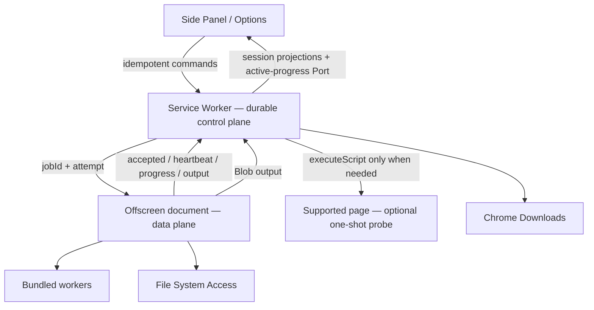

# Architecture

Tako is a WXT Manifest V3 extension targeting Chrome 150. It separates durable
control from long-running data work so Service Worker suspension cannot silently
lose or duplicate a download.

## Runtime boundaries



### Side Panel and Options

- Present data and forms; never mutate durable queue state directly.
- Read queue, context, destination issues, and recovery state from
  `chrome.storage.session` projections.
- Open a named `runtime.Port` only for high-frequency active-task progress;
  reconnects fall back to the latest session snapshot.
- Include `windowId`, `tabId`, request/command identity, and expected revision
  where applicable.
- Keep the current Side Panel layout: inline chapter selector, unified
  nonterminal queue with the active task first, and separate recent history.

### Service Worker

- Registers Chrome event listeners synchronously at module load.
- Serializes commands and is the only durable queue/task-state mutator.
- Persists intent before effects: queue transitions, dispatch lease, pending
  native output, destination issues, Undo actions, and provider dispatch
  deadline.
- Owns privileged Chrome APIs: downloads, permissions, alarms, notifications,
  badge, scripting, and offscreen lifecycle.
- Reconciles current offscreen job and native downloads on every initialization.

### Offscreen document

- Owns provider API/HTML/image requests, per-origin scheduling, retry timers,
  transforms/descrambling, archive creation, FSA writes, and Blob URLs.
- Communicates through `chrome.runtime`; other extension APIs remain in the
  Service Worker.
- Emits job acceptance and a dedicated heartbeat independent from progress.
- Uses bundled workers for CPU-heavy compression/transforms when appropriate.
- Stays alive while Chrome still reads a Blob-backed output.

### Page probe

There is no resident content script by default. Active-tab context resolves in
this order:

1. URL parsing.
2. Provider API.
3. Fetched provider HTML parsed in extension/offscreen context.
4. A bundled, read-only, isolated-world one-shot
   `chrome.scripting.executeScript` probe only for live DOM or page-owned
   storage.

The probe returns schema-validated plain data, accepts no remote code/selectors,
installs no listener/timer, and cannot write extension storage or operate the
queue. Main-world execution requires an integration-specific reason.

## Durable job protocol

Every chapter attempt has a stable `jobId` and monotonic `attempt`.

```text
SW persists dispatch lease
  → SW sends START_JOB
  → offscreen sends JOB_ACCEPTED
  → offscreen sends HEARTBEAT and phase progress
  → offscreen prepares/writes requested outputs
  → SW/offscreen commit destination results
  → SW persists chapter/task outcome
  → SW clears lease and dispatches next eligible work
```

The offscreen document rejects duplicate/stale jobs. Duplicate UI commands and
output handoffs return their prior result. On Service Worker wake:

1. Hydrate durable state.
2. Check `chrome.offscreen.hasDocument()`.
3. Query its current job.
4. Reconcile `jobId`/`attempt`, pending native output, and lease.
5. Resume observation, replay idempotently, or mark only unrecoverable work
   interrupted.

The watchdog alarm uses `persistAcrossSessions: true` and is verified/recreated
at initialization. It is armed for executing offscreen work or an active
offscreen dispatch lease, not merely for a Chrome-owned download. Multiple
missed heartbeats trigger `QUERY_JOB` before any recovery teardown. Native
download completion is event-driven through `downloads.onChanged`, with startup
reconciliation covering events missed while the Service Worker was stopped.

## Output transaction

“Completed” means usable output exists at the requested destination.

### Chrome Downloads

1. Offscreen creates a Blob URL and sends `OUTPUT_READY` with task, chapter,
   job, attempt, and output identity.
2. Service Worker persists a prepared output record, then calls
   `chrome.downloads.download()`.
3. A numeric `downloadId` means Chrome successfully started the download. Tako
   keeps that ID observable even if the following local-storage write fails; the
   prepared record remains restart-reconcilable by Blob URL.
4. Service Worker observes `downloads.onChanged` and reconciles the durable ID
   with `chrome.downloads.search()` after startup or a transient storage
   failure.
5. `complete` commits the output; `interrupted` records a typed output failure.
6. Service Worker tells offscreen to revoke the Blob URL after terminal state.

A pending native download is a durable wait state, not a liveness failure. Tako
does not poll known long-running Chrome downloads with the offscreen watchdog.

Canceling a task stops future dispatch and uncommitted pipeline work. It does
not cancel native downloads already accepted by Chrome.

### File System Access

The task's destination is snapshotted at enqueue. Before promotion, Tako checks
capability, handle presence, and `queryPermission({mode:'readwrite'})`. A write
commits only after the writable stream closes successfully.

Unsupported, prompt/denied, missing-folder, write, or disk-full failures persist
a `DestinationIssue`, block further dispatch, and show repair actions. The queue
transition and destination-issue mutation use one durable local-storage commit,
followed by best-effort session projection and notification. Tako never silently
changes the destination. The user can explicitly re-grant, reselect, continue
that task in Downloads, or cancel.

Both destinations use one `uniquify | overwrite` collision policy; `uniquify` is
the default.

## Task and chapter outcomes

```typescript
type TaskStatus =
  | "queued"
  | "downloading"
  | "completed"
  | "partial_success"
  | "failed"
  | "canceled"

type ChapterStatus =
  | "queued"
  | "downloading"
  | "completed"
  | "partial_success"
  | "failed"
  | "canceled"
  | "skipped"
```

- `completed`: every requested output committed.
- `partial_success`: some usable requested output committed, but the request is
  incomplete. Partially saved loose images count even if no whole chapter did.
- `failed`: no usable requested output committed.
- On cancellation, the active uncommitted chapter becomes `canceled`, remaining
  queued chapters become `skipped`, and terminal chapter outcomes remain.

There is no Pause state. A destination prerequisite is an external
action-required block, not Pause.

## Progress

Offscreen reports resolving, downloading, transforming, archiving, and saving
stages. Live updates use the Side Panel Port; session storage keeps a
bounded-cadence latest snapshot for reconnect.

Overall percentage is weighted by locally learned phase duration using provider,
transform type, bytes/pixels, archive format, and destination. It is monotonic,
does not fabricate progress from elapsed time alone, and remains below 100%
until destination commit.

## Storage ownership

| Store                    | Canonical data                                                                                                                                |
| ------------------------ | --------------------------------------------------------------------------------------------------------------------------------------------- |
| `chrome.storage.local`   | queue/history, settings, queue revision, dispatch lease, pending native output identity, destination issues, pending Undo actions, migrations |
| `chrome.storage.session` | current queue/history/context/progress recovery snapshots                                                                                     |
| IndexedDB                | selected `FileSystemDirectoryHandle` only                                                                                                     |
| Runtime Port             | high-frequency active-task progress only                                                                                                      |
| React state              | component/view state and chapter selection drafts for this phase                                                                              |

Large Blobs are never stored in Chrome storage.

## Site integrations

Each manifest declares identity, maturity, shipped/default state, implementation
type, match patterns, required origins, page-probe need, broad-permission need,
capabilities, rate/timeout policies, and custom settings.

The current bundled integrations are MangaDex, Pixiv Comic, Shonen Jump+,
Manhuagui, and Comic Nettai. The set is extensible. New integrations begin
Experimental and may become Stable after deterministic fixtures and several days
of live smoke testing. Stability describes observed behavior, not API
officiality.

MangaDex is disabled by default. Enabling it from Options requests optional
`https://*/*` access for dynamic MangaDex@Home nodes. Runtime URL policy remains
narrow even after Chrome grants that broad permission.

All integration requests use a shared hardened layer: HTTPS and origin policy,
pre-follow redirect rejection, defensive final-URL validation, declared
credential mode, private/loopback rejection unless explicitly approved,
response/redirect limits, abort signals, MIME plus magic-byte and
pixel-dimension validation, filename sanitization, and structured retry/error
classification.

## Error and diagnostic boundary

The UI shows localized plain-language categories. It never displays raw browser
errors, stack traces, signed URLs, headers, or provider bodies. Technical detail
goes to redacted extension console diagnostics. `runtime.lastError.message` is
not parsed because Chrome does not define it as a stable machine-readable API.

## Scope boundaries

- Same-profile queue state is global; routing identifiers are present now.
- Full multi-window context/selection isolation and incognito split mode are a
  separate tested phase.
- Compatibility below Chrome 150 is not maintained.
- Pause/resume and a broad Side Panel redesign are out of scope.

## Related references

- [Site Integration Guide](Site-Integration-Guide.md)
- [Chrome offscreen API](https://developer.chrome.com/docs/extensions/reference/api/offscreen)
- [Chrome downloads API](https://developer.chrome.com/docs/extensions/reference/api/downloads)
